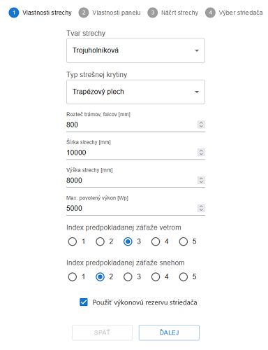
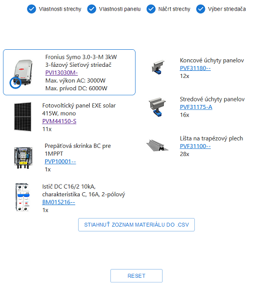

# PV-Calculator
is a React Js app meant for my colleagues and our customers. It allows the user to easily get an electrical and mounting material necessary to build photovoltaic power plant (residential, up to 10kW AC). The app is currently in __Slovak__ language, however, I plan to add possibility to switch to English in near future.

The app runs on heroku: [PV-Calculator](https://pv-calculator.herokuapp.com/)

## Usage
The app composes out of five steps: __roof parameters, panel parameters, roof sketch, invertor selection__ and finally __material output__. 

+ In the first two steps you enter parameters like __width and height of the roof__ or __power of used photovoltaic panel__ (step 2 is currently disabled), these information are necessary for the calculation of panel's layout. 

+ In step three __the roof shape is drawn__ (created with html elements) onto the screen together with max. possible amount of panels (or up to max. allowed power if some value vas entered in step one), which can fit onto the roof. Hence, the __user is allowed to delete panels individually__ to reduce the power of the plant.

+ Fourth step allows the user to __select an invertor out of three suitable ones__ (suitable with power and voltage). It is also possible to continue without selected invertor, in this case, invertor together with its protection devices won't be included in output material.

+ Finally, the fifth step __displays invertor, protection devices and mounting material__ necessary to build a PV plant. User is allowed to download the output into .csv file compatible with our company's shopping basket. Hence, they can import the material to e-shop.

## Screenshots

## Used external libraries
+ [Material UI](https://mui.com/material-ui/ "Material UI webpage")

  Material UI was used to create each input in first two steps and the stepper.

+ [React CSV](https://github.com/react-csv/react-csv#readme "React CSV github readme")

  Is used to download the output in the last step.

###

## How to run locally
1. Clone the repository
2.  npm start